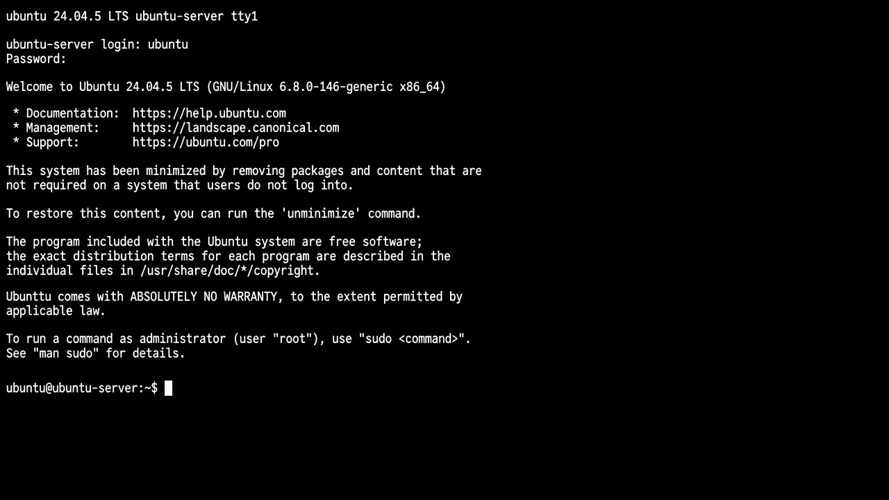

# First boot

At the console login prompt:

```text
ubuntu-server login: ubuntu
Password: …
```

(Use the hostname and username you chose at install.)



A minimized install shows the MOTD about a smaller package set and
`unminimize`. Leave it minimized unless a later lab needs the fuller set.

<div class="run" markdown>

```bash
hostnamectl
ip a
systemctl is-active ssh
```

```text {.no-copy}
Static hostname: ubuntu-server
…
inet 192.168.1.50/24 … enp3s0
active
```

</div>


If `ssh` is not `active`:

<div class="run" markdown>

```bash
sudo apt-get update
sudo apt-get install -y openssh-server curl
sudo systemctl enable --now ssh
systemctl is-active ssh
```

```text {.no-copy}
…
active
```

</div>

Otherwise install `curl` (handy for later labs):

<div class="run" markdown>

```bash
sudo apt-get update
sudo apt-get install -y curl
```

```text {.no-copy}
… Setting up curl …
```

</div>

Note the LAN IPv4 from `ip a` for the next page.

## Next

[Prove SSH](prove-ssh.md)
