# Install

Screenshots below are full-bleed captures (1280×720) of the same Subiquity /
console look — no phone photos of the monitor.

## Boot from USB

1. Plug the USB into the target machine; connect display, keyboard, and Ethernet.
2. Power on. Open the boot menu (often **F10**, **F12**, or **Esc**; BIOS setup
   often **F2** or **Del** — varies by vendor).

   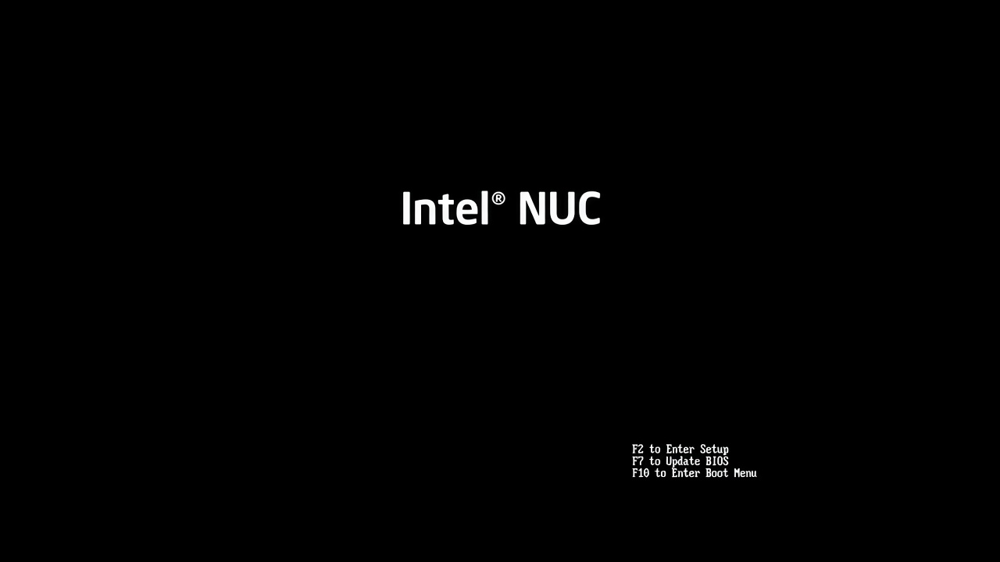

3. Boot the USB in **UEFI** mode when both UEFI and legacy appear.
4. At GRUB, choose **Try or Install Ubuntu Server**.

   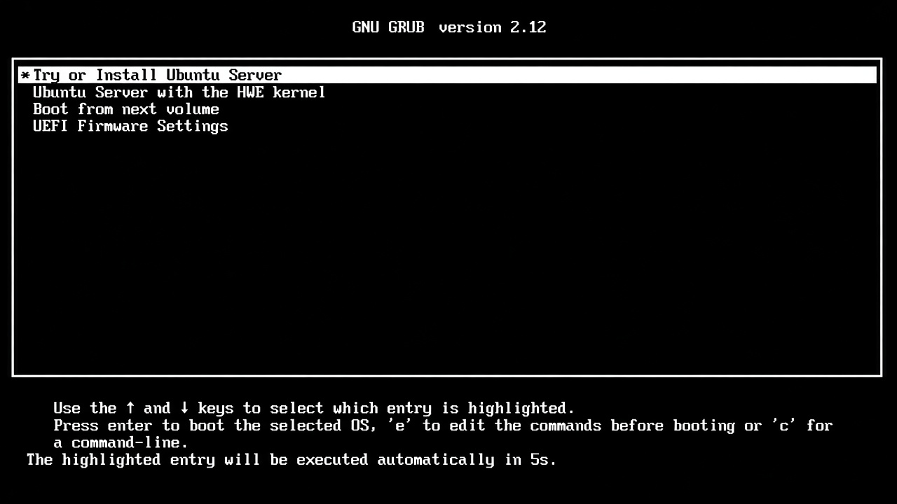

## Subiquity choices

Move with arrow keys; **Enter** to select; spacebar to toggle checkboxes.

Table rows match the screenshots below (same order).

| Screen | Choice (as in the image) |
| --- | --- |
| Language | **English** |
| Keyboard | **English (US)** |
| Install type | **Ubuntu Server (minimized)**; third-party drivers unchecked |
| Network | `enp3s0` DHCPv4 (example `192.168.1.50/24`); leave Wi‑Fi unused |
| Proxy | **Proxy address** blank |
| Mirror | Accept default / tested mirror → Done |
| Storage | Entire internal disk; grow `ubuntu-lv` before Done (default leaves ~half free) |
| Profile | name `Lab User`, hostname **`ubuntu-server`**, user **`ubuntu`**, set a password |
| Ubuntu Pro | **Skip for now** |
| SSH | **Install OpenSSH server** + **Allow password authentication over SSH** |
| Featured snaps | **None** checked → Done |
| Finish | **Reboot Now**, then remove media |

### Language

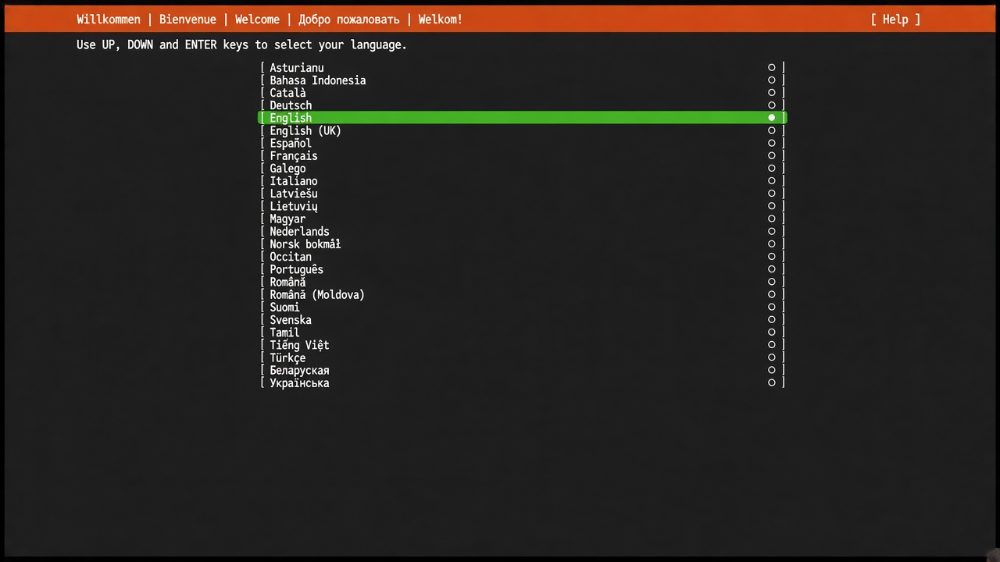

### Keyboard

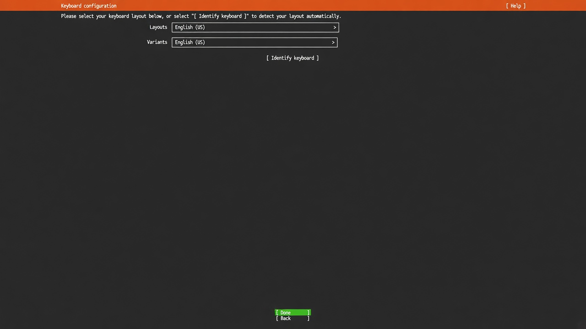

### Install type

Choose **Ubuntu Server (minimized)**. Leave **Search for third-party drivers**
unchecked.

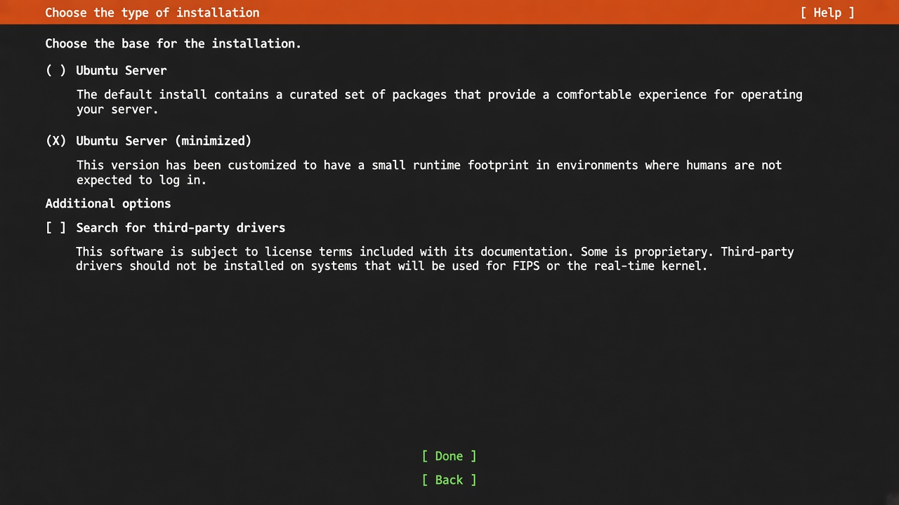

### Network

On wired Ethernet, accept DHCPv4 and note the IPv4 for later SSH. Leave Wi‑Fi
disconnected unless you need it.

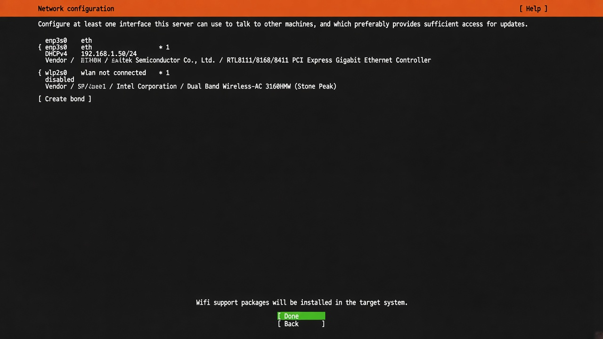

### Proxy

Leave **Proxy address** blank unless you need an HTTP proxy.

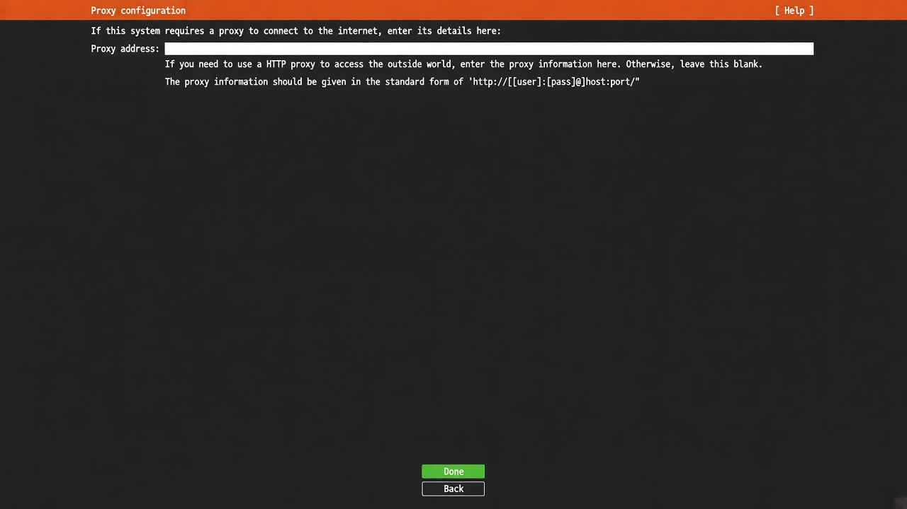

### Mirror

Accept the suggested mirror (installer tests it) → **Done**.

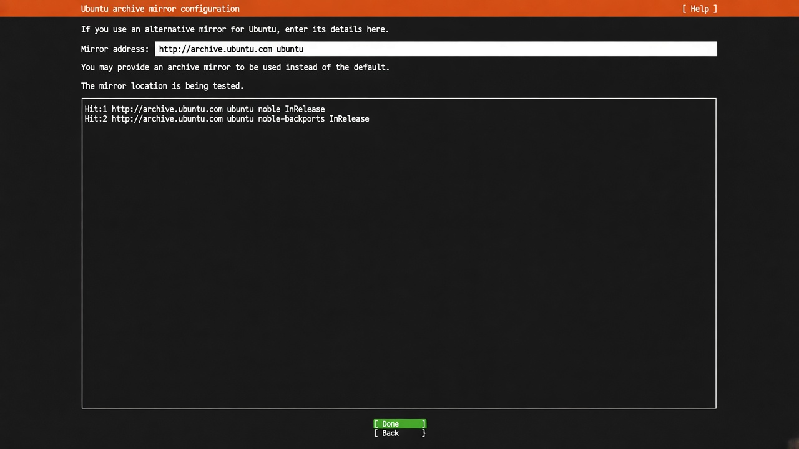

### Storage

**Use an entire disk** on the **internal** drive (not the installer USB).

The shot below is the default layout: `ubuntu-lv` ~half of `ubuntu-vg`, with
**free space** still listed. Before **Done**, highlight **`ubuntu-lv`** →
**Enter** → **Edit** → set **Size** to the full VG capacity (or clear/max) so
free space is gone.

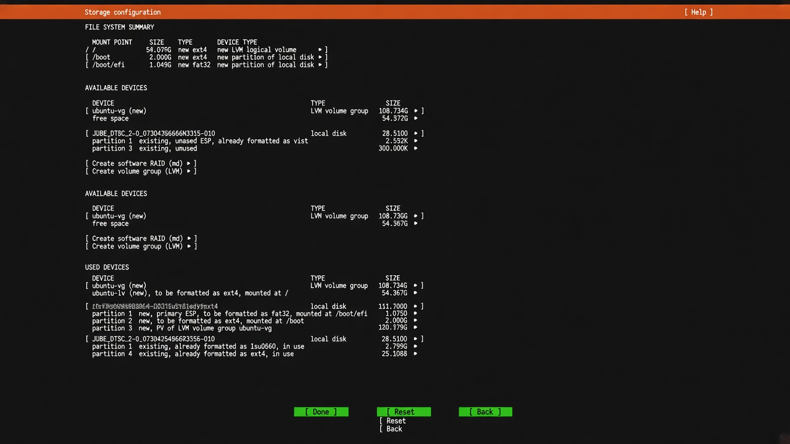

!!! danger "Entire disk"
    **Use an entire disk** erases that drive. Confirm you selected the machine’s
    internal storage, not the installer USB.

### Profile

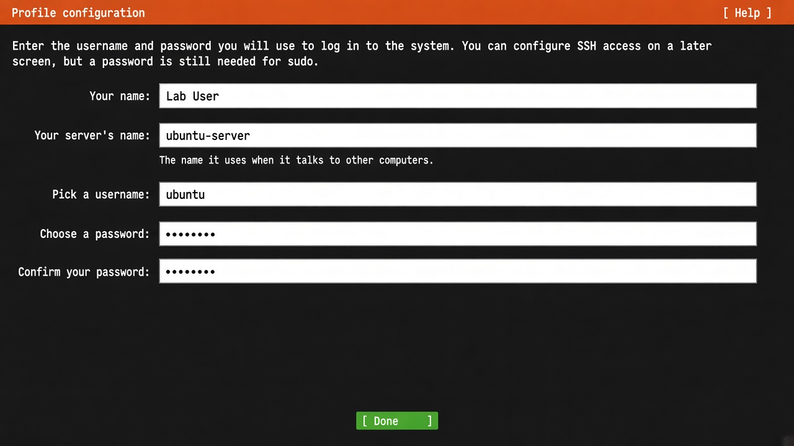

### Ubuntu Pro

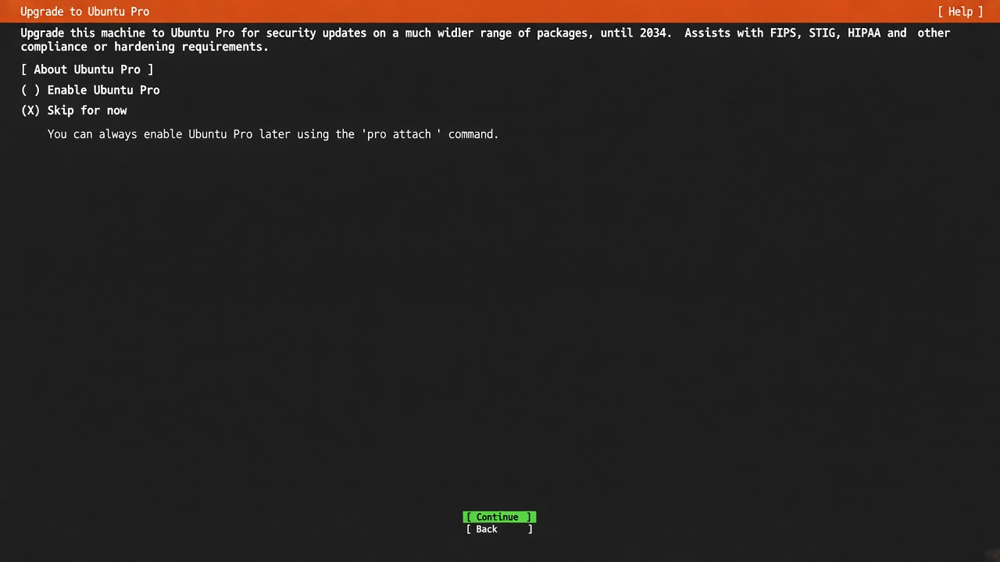

### SSH

Check both **Install OpenSSH server** and **Allow password authentication over
SSH**.

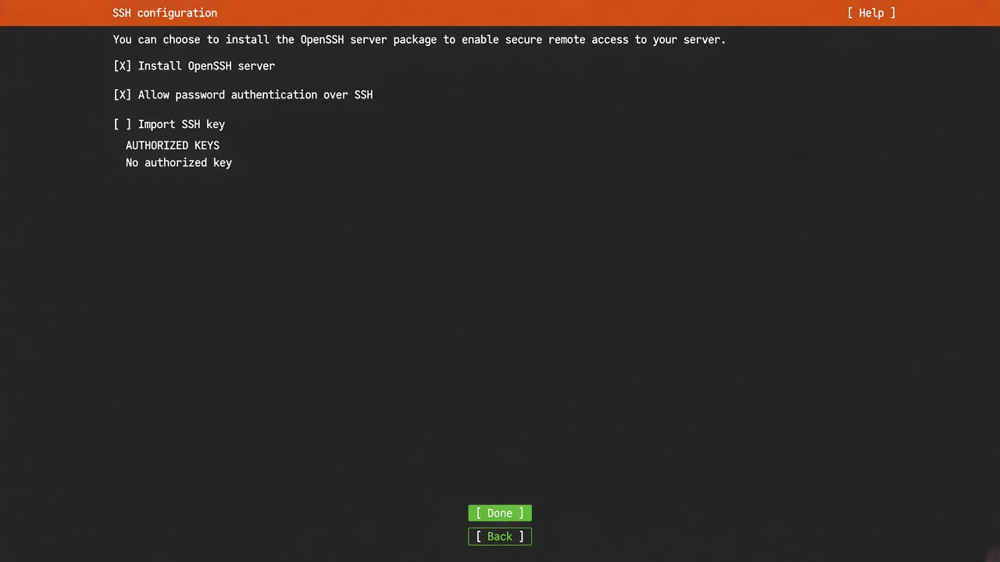

### Featured snaps

Leave all unchecked → **Done**.

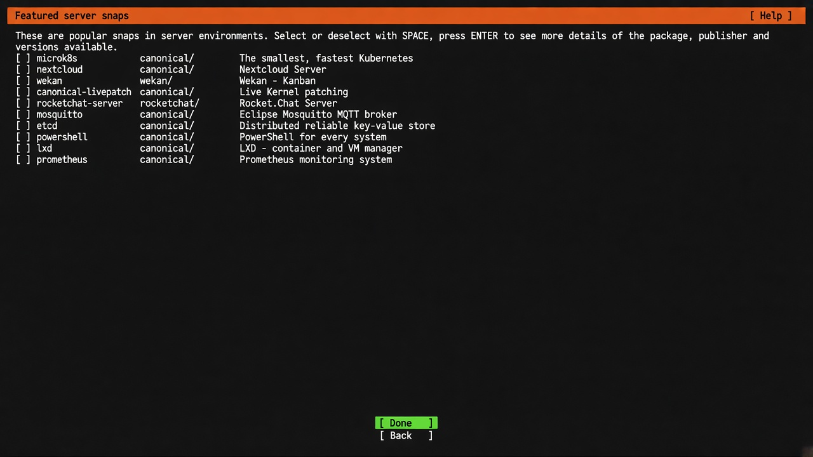

### Finish

Wait for **Installation complete!**, choose **Reboot Now**, remove the USB when
asked, then boot from disk.

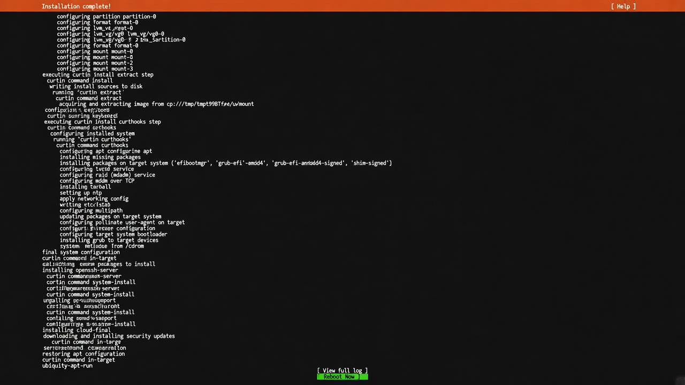

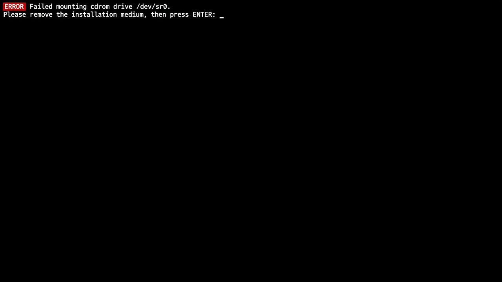

Pull the installer USB out, then press **Enter**. A red
`Failed mounting cdrom drive /dev/sr0` line here is normal after the stick is
gone — it is not an install failure.

## Next

[First boot](first-boot.md)
